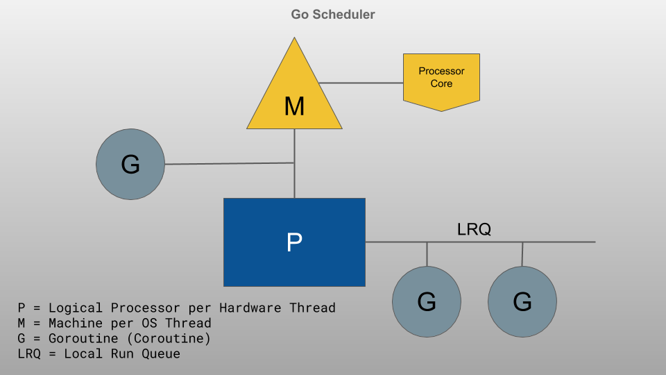
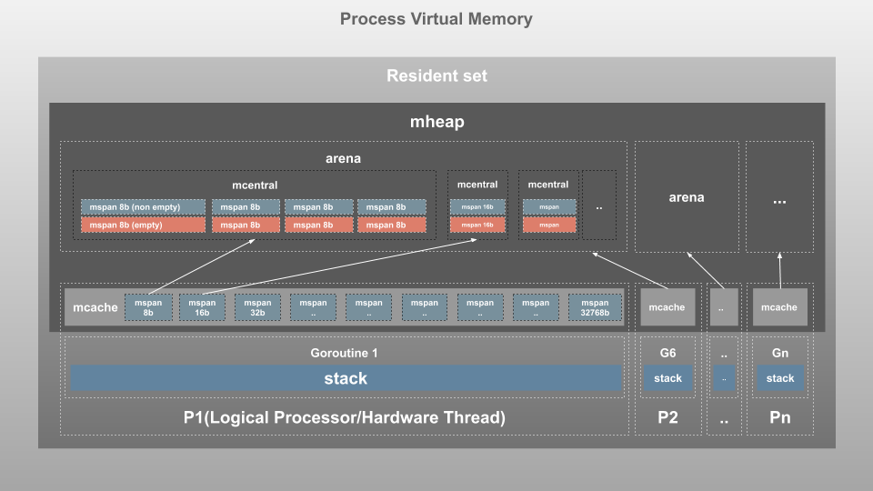
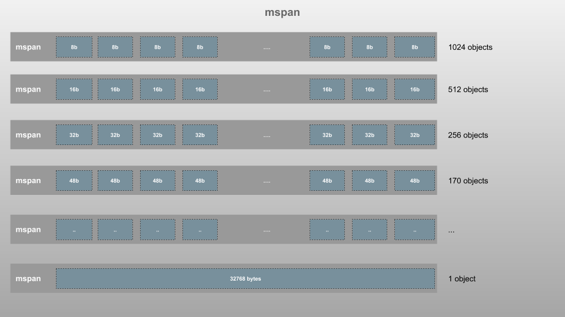
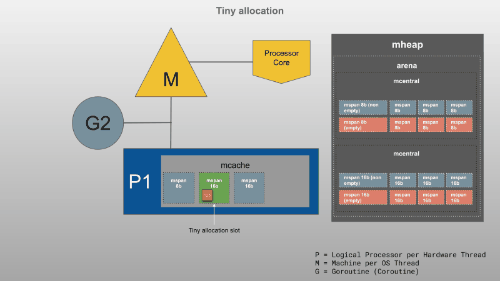
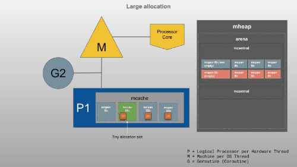

Конечно, вот перевод статьи с сохранением терминологии.

---

### Visualizing memory management in Golang (Визуализация управления памятью в Golang)

**Оригинал статьи:** https://deepu.tech/memory-management-in-golang/

В этой серии из нескольких частей я стремлюсь прояснить концепции, лежащие в основе управления памятью, и более глубоко рассмотреть управление памятью в некоторых современных языках программирования. Я надеюсь, что эта серия даст вам некоторое представление о том, что происходит "под капотом" этих языков с точки зрения управления памятью.

В этой главе мы рассмотрим управление памятью в языке программирования Go (Golang). Go — это статически типизированный и компилируемый язык, как C/C++ и Rust. Следовательно, Go не требуется виртуальная машина (VM), а бинарные файлы приложений Go включают в себя небольшую встроенную среду выполнения (runtime), которая заботится о таких возможностях языка, как сборка мусора (Garbage collection), планирование (scheduling) и конкурентность (concurrency).

Если вы не читали первую часть этой серии, пожалуйста, прочтите ее сначала, так как там я объяснил разницу между памятью стека (Stack) и кучи (Heap), что будет полезно для понимания этой главы.

*Эта статья основана на стандартной официальной реализации Go 1.13, и детали концепций могут измениться в будущих версиях Go.*

### Go internal memory structure (Внутренняя структура памяти Go)

Сначала давайте посмотрим, какова внутренняя структура памяти в Go.

Среда выполнения (Runtime) Go назначает Горутины (G) на Логические Процессоры (P) для выполнения. У каждого P есть машина (M). Мы будем использовать P, M и G на протяжении всей этой статьи. Если вы не знакомы с планировщиком Go, сначала прочтите [Go scheduler: Ms, Ps & Gs](https://www.ardanlabs.com/blog/2018/08/scheduling-in-go-part2.html).



**Go Scheduler (Планировщик Go)**

Каждому процессу программы Go операционная система (ОС) выделяет некоторую виртуальную память (virtual memory), это общий объем памяти, к которому процесс имеет доступ. Фактическая память, используемая в пределах виртуальной памяти, называется резидентным набором (Resident Set). Это пространство управляется внутренними структурами памяти, как показано ниже:



**Go Memory structure (Структура памяти Go)**

Это упрощенное представление, основанное на внутренних объектах, используемых Go. В действительности Go делит и группирует память на страницы, как описано в [этой замечательной статье](https://medium.com/@ankur_goyal/a-visual-guide-to-golang-memory-allocator-from-ground-up-e132258453ed).

Это сильно отличается от структуры памяти, которую мы видели в предыдущих главах для JVM и V8. Как вы можете видеть, здесь нет поколенческой памяти (generational memory). Основная причина этого — TCMalloc (Thread-Caching Malloc), на основе которого был смоделирован собственный аллокатор памяти Go.

Давайте посмотрим, что представляют собой различные структуры:

#### Page Heap (mheap) (Куча страниц (mheap))

Здесь Go хранит динамические данные (любые данные, размер которых нельзя вычислить во время компиляции). Это самый большой блок памяти, и именно здесь происходит сборка мусора (Garbage Collection, GC).

Резидентный набор (resident set) разделен на страницы по 8 КБ каждая и управляется одним глобальным объектом `mheap`.

Крупные объекты (объекты размером > 32 КБ) выделяются напрямую из `mheap`. Эти крупные запросы требуют центральной блокировки, поэтому в любой момент времени может быть обслужен только запрос одного P.

`mheap` управляет страницами, сгруппированными в различные структуры, как показано ниже:

*   **mspan**: `mspan` — это самая базовая структура, которая управляет страницами памяти в `mheap`. Это двусвязный список, который хранит адрес начальной страницы, класс размера диапазона и количество страниц в диапазоне. Подобно TCMalloc, Go также делит страницы памяти на блоки 67 различных классов по размеру, от 8 байт до 32 килобайт, как на изображении ниже.

    

    Каждый диапазон существует в двух экземплярах: один для объектов с указателями (классы для сканирования, scan classes) и один для объектов без указателей (классы без сканирования, noscan classes). Это помогает во время GC, так как диапазоны `noscan` не нужно обходить в поисках живых объектов.

*   **mcentral**: `mcentral` группирует диапазоны (`span`) одного класса размера. Каждый `mcentral` содержит два `mspanList`:
    *   **empty**: Двусвязный список диапазонов без свободных объектов или диапазонов, которые кэшированы в `mcache`. Когда диапазон здесь освобождается, он перемещается в список `non-empty`.
    *   **non-empty**: Двусвязный список диапазонов со свободными объектами. Когда из `mcentral` запрашивается новый диапазон, он берется из списка `non-empty` и перемещается в список `empty`.
    Когда у `mcentral` нет свободных диапазонов, он запрашивает новый набор страниц из `mheap`.

*   **arena**: Память кучи растет и сжимается по мере необходимости в пределах выделенной виртуальной памяти. Когда требуется больше памяти, `mheap` забирает ее из виртуальной памяти порцией в 64 МБ (для 64-битных архитектур), называемой ареной (arena). Здесь страницы отображаются на диапазоны (`span`).

*   **mcache**: Это очень интересная структура. `mcache` — это кэш памяти, предоставляемый P (Логическому Процессору) для хранения небольших объектов (размер объекта <= 32 КБ). Хотя это напоминает стек потока, это часть кучи и используется для динамических данных. `mcache` содержит `mspan` типов `scan` и `noscan` для всех классов размеров. Горутины могут получать память из `mcache` без каких-либо блокировок, так как P может иметь только одну G в один момент времени. Следовательно, это более эффективно. `mcache` запрашивает новые диапазоны (`span`) из `mcentral` по мере необходимости.

#### Stack (Стек)

Это область памяти стека, и для каждой Горутины (G) существует свой стек. Здесь хранятся статические данные, включая фреймы функций, статические структуры, примитивные значения и указатели на динамические структуры. Это не то же самое, что `mcache`, который назначается P.

### Go memory usage (Stack vs Heap) (Использование памяти в Go (Стек против Кучи))

Теперь, когда мы разобрались, как организована память, давайте посмотрим, как Go использует Стек и Кучу при выполнении программы.

Давайте используем следующую программу на Go. Код не оптимизирован с точки зрения корректности, поэтому игнорируйте такие проблемы, как ненужные промежуточные переменные и т.п., основное внимание уделяется визуализации использования памяти стека и кучи.

```go
package main

import "fmt"

type Employee struct {
  name   string
  salary int
  sales  int
  bonus  int
}

const BONUS_PERCENTAGE = 10

func getBonusPercentage(salary int) int {
  percentage := (salary * BONUS_PERCENTAGE) / 100
  return percentage
}

func findEmployeeBonus(salary, noOfSales int) int {
  bonusPercentage := getBonusPercentage(salary)
  bonus := bonusPercentage * noOfSales
  return bonus
}

func main() {
  var john = Employee{"John", 5000, 5, 0}
  john.bonus = findEmployeeBonus(john.salary, john.sales)
  fmt.Println(john.bonus)
}
```

Одно из основных отличий Go от многих языков со сборкой мусора заключается в том, что многие объекты размещаются непосредственно в стеке программы. Компилятор Go использует процесс, называемый **анализом ускользания (escape analysis)**, чтобы найти объекты, время жизни которых известно во время компиляции, и размещает их в стеке, а не в памяти кучи, управляемой сборщиком мусора. Во время компиляции Go выполняет анализ ускользания, чтобы определить, что может попасть в стек (статические данные), а что должно попасть в кучу (динамические данные). Мы можем увидеть эти детали во время компиляции, запустив `go build` с флагом `-gcflags '-m'`. Для приведенного выше кода вывод будет примерно таким:

```bash
❯ go build -gcflags '-m' gc.go
# command-line-arguments
temp/gc.go:14:6: can inline getBonusPercentage
temp/gc.go:19:6: can inline findEmployeeBonus
temp/gc.go:20:39: inlining call to getBonusPercentage
temp/gc.go:27:32: inlining call to findEmployeeBonus
temp/gc.go:27:32: inlining call to getBonusPercentage
temp/gc.go:28:13: inlining call to fmt.Println
temp/gc.go:28:18: john.bonus escapes to heap
temp/gc.go:28:13: io.Writer(os.Stdout) escapes to heap
temp/gc.go:28:13: main []interface {} literal does not escape
<autogenerated>:1: os.(*File).close .this does not escape
```

Давайте это визуализируем. Кликайте на слайды и перемещайтесь вперед/назад с помощью клавиш со стрелками, чтобы увидеть, как выполняется приведенная выше программа и как используется память стека и кучи:

<center>[Слайды] </center>

*Примечание: Если слайды выглядят обрезанными по краям, нажмите на заголовок слайда или [здесь](https://speakerdeck.com/deepu105/visualizing-memory-management-in-golang), чтобы открыть их непосредственно в SpeakerDeck.*

Как вы можете видеть:

*   Главная функция `main` хранится в «главном фрейме» в стеке (Stack).
*   Каждый вызов функции добавляется в память стека как блок фрейма.
*   Все статические переменные, включая аргументы и возвращаемое значение, сохраняются внутри блока фрейма функции в стеке.
*   Все статические значения, независимо от типа, хранятся непосредственно в стеке. Это относится и к глобальной области видимости.
*   Все динамические типы создаются в куче (Heap) и ссылаются из стека с помощью указателей. Объекты размером менее 32 КБ попадают в `mcache` процессора P. Это также относится и к глобальной области видимости.
*   Структура со статическими данными хранится в стеке до тех пор, пока в нее не будет добавлено какое-либо динамическое значение, после чего структура перемещается в кучу.
*   Функции, вызываемые из текущей функции, помещаются на вершину стека.
*   Когда функция возвращает значение, ее фрейм удаляется из стека.
*   После завершения основного процесса объекты в куче больше не имеют указателей из стека и становятся "осиротевшими" (orphan).

Стек, как вы видите, управляется автоматически, и это делается операционной системой, а не самим Go. Следовательно, нам не нужно сильно беспокоиться о стеке. Куча, с другой стороны, не управляется автоматически ОС, и поскольку это самое большое пространство памяти, хранящее динамические данные, она может расти экспоненциально, приводя к тому, что у нашей программы со временем закончится память. Со временем она также становится фрагментированной, замедляя работу приложений. Именно здесь на помощь приходит сборка мусора.

### Go Memory management (Управление памятью в Go)

Управление памятью в Go включает автоматическое выделение памяти при необходимости и сборку мусора, когда память больше не нужна. Это делается стандартной библиотекой. В отличие от C/C++, разработчику не нужно этим заниматься, а базовое управление, выполняемое Go, хорошо оптимизировано и эффективно.

#### Memory Allocation (Выделение памяти)

Многие языки программирования, использующие сборку мусора, применяют поколенческую структуру памяти (generational memory structure) для повышения эффективности сбора мусора, а также уплотнение (compaction) для уменьшения фрагментации. Конечно, продолжаю перевод.

---

Go здесь использует другой подход, как мы видели ранее, Go структурирует память совершенно иначе. Go использует локальный кэш потока (thread-local cache) для ускорения выделения небольших объектов и поддерживает диапазоны с/без сканирования (scan/noscan spans) для ускорения сборки мусора. Эта структура вместе с процессом в значительной степени предотвращает фрагментацию, делая уплотнение (compaction) ненужным во время сборки мусора. Давайте посмотрим, как происходит это выделение.

Go определяет процесс выделения памяти для объекта в зависимости от его размера и делит его на три категории:

*   **Крошечные (Tiny, размер < 16Б)**: Объекты размером менее 16 байт выделяются с помощью крошечного аллокатора (tiny allocator) в `mcache`. Это эффективно, и несколько крошечных выделений производятся в одном 16-байтном блоке.

    

*   **Маленькие (Small, размер 16Б ~ 32КБ)**: Объекты размером от 16 байт до 32 килобайт выделяются в соответствующем классе размера (`mspan`) в `mcache` того P, где выполняется G.

    

    Как при крошечном, так и при маленьком выделении, если список `mspan` пуст, аллокатор получит набор страниц из `mheap` для использования в `mspan`. Если `mheap` пуст или не имеет достаточно больших наборов страниц, он выделяет новую группу страниц (не менее 1 МБ) у ОС.

*   **Большие (Large, размер > 32КБ)**: Объекты размером более 32 килобайт выделяются непосредственно в соответствующем классе размера в `mheap`. Если `mheap` пуст или не имеет достаточно больших наборов страниц, он выделяет новую группу страниц (не менее 1 МБ) у ОС.

    

*Примечание: Вы можете найти приведенные выше GIF-изображения в виде слайд-шоу [здесь](https://speakerdeck.com/deepu105/visualizing-memory-management-in-golang).*

#### Garbage collection (Сборка мусора)

Теперь, когда мы знаем, как Go выделяет память, давайте посмотрим, как он автоматически собирает мусор в памяти кучи, что очень важно для производительности приложения. Когда программа пытается выделить в куче больше памяти, чем доступно, мы сталкиваемся с ошибками нехватки памяти (out of memory errors). Неправильно управляемая куча также может вызвать утечку памяти (memory leak).

Go управляет памятью кучи с помощью сборки мусора. Простыми словами, он освобождает память, используемую "осиротевшими" объектами (orphan objects), то есть объектами, на которые больше нет прямых или косвенных ссылок из стека (через ссылку в другом объекте), чтобы освободить место для создания новых объектов.

Начиная с версии 1.12, Golang использует непоколенческий, конкурентный сборщик мусора на основе трехцветной пометки и очистки (non-generational concurrent tri-color mark and sweep collector). Процесс сборки примерно выглядит так, как показано ниже. Я не хочу вдаваться в детали, так как они меняются от версии к версии. Однако, если вы заинтересованы в них, я рекомендую [эту замечательную серию статей](https://blog.golang.org/ismmkeynote).

Процесс начинается, когда достигается определенный процент (GC Percentage) выделений в куче, и сборщик выполняет различные фазы работы:

1.  **Настройка пометки (Mark Setup) (Остановка мира - Stop the world)**: Когда начинается сборка мусора, сборщик включает барьеры записи (write barriers), чтобы можно было поддерживать целостность данных во время следующей конкурентной фазы. Этот шаг требует очень короткой паузы, так как каждая работающая Горутина приостанавливается для этого, а затем продолжает работу.
2.  **Пометка (Marking) (Конкурентно)**: После включения барьеров записи начинается фактический процесс пометки, параллельно с работой приложения, используя 25% доступной мощности ЦП. Соответствующие P резервируются до завершения пометки. Это делается с помощью выделенных Горутин. Здесь GC помечает в куче значения, которые являются "живыми" (на них есть ссылки из стека любой активной Горутины). Когда сборка занимает много времени, процесс может задействовать активные Горутины из приложения для помощи в процессе пометки. Это называется **помощью в пометке (Mark Assist)**.
3.  **Завершение пометки (Mark Termination) (Остановка мира - Stop the world)**: После завершения пометки каждая активная Горутина приостанавливается, барьеры записи отключаются, и начинаются задачи очистки. Здесь GC также вычисляет следующую цель для сборки мусора (GC goal). Как только это будет сделано, зарезервированные P возвращаются приложению.
4.  **Очистка (Sweeping) (Конкурентно)**: После завершения сборки и при попытке выделения памяти начинается процесс очистки для возвращения памяти из кучи, которая не была помечена как "живая". Объем очищаемой памяти синхронен с объемом выделяемой памяти.

Давайте посмотрим на это в действии для одной Горутины. Количество объектов для краткости уменьшено. Кликайте на слайды и перемещайтесь вперед/назад с помощью клавиш со стрелками, чтобы увидеть процесс:

<center>[Слайды] </center>

*Примечание: Если слайды выглядят обрезанными по краям, нажмите на заголовок слайда или [здесь](https://speakerdeck.com/deepu105/visualizing-memory-management-in-golang), чтобы открыть их непосредственно в SpeakerDeck.*

*   Мы рассматриваем одну Горутину, фактический процесс делает это для всех активных Горутин. Сначала включаются барьеры записи (write barriers).
*   Процесс пометки берет корень GC (GC root) и окрашивает его в черный цвет, а затем обходит указатели от него вглубь, как по дереву. Каждый встреченный объект он помечает серым цветом.
*   Когда он достигает объекта в диапазоне `noscan` или когда у объекта больше нет указателей, он завершает работу с этим корнем и переходит к следующему корневому объекту GC.
*   После сканирования всех корней GC он берет серый объект и продолжает обходить его указатели аналогичным образом.
*   Если во время работы барьеров записи происходят изменения указателей на объект, этот объект окрашивается в серый цвет, чтобы GC повторно его просканировал.
*   Когда серых объектов больше не остается, процесс пометки завершается, и барьер записи отключается.
*   Очистка (Sweeping) начнется, когда начнутся новые выделения памяти.

В этом процессе есть моменты "остановки мира" (stop-the-world), но они обычно настолько быстры, что в большинстве случаев ими можно пренебречь. Окрашивание объектов происходит в атрибуте `gcmarkBits` в диапазоне (`span`).

### Conclusion (Заключение)

Эта статья должна была дать вам общее представление о структуре памяти и управлении памятью в Go. Она не является исчерпывающей, существует гораздо больше продвинутых концепций, и детали реализации продолжают меняться от версии к версии. Но для большинства разработчиков на Go этого уровня информации будет достаточно, и я надеюсь, что это поможет вам писать более качественный код с учетом этих аспектов для создания более производительных приложений, а также поможет избежать следующей проблемы с утечкой памяти, с которой вы могли бы столкнуться.

Надеюсь, вам было интересно это изучать. Оставайтесь на связи для следующей статьи в серии.